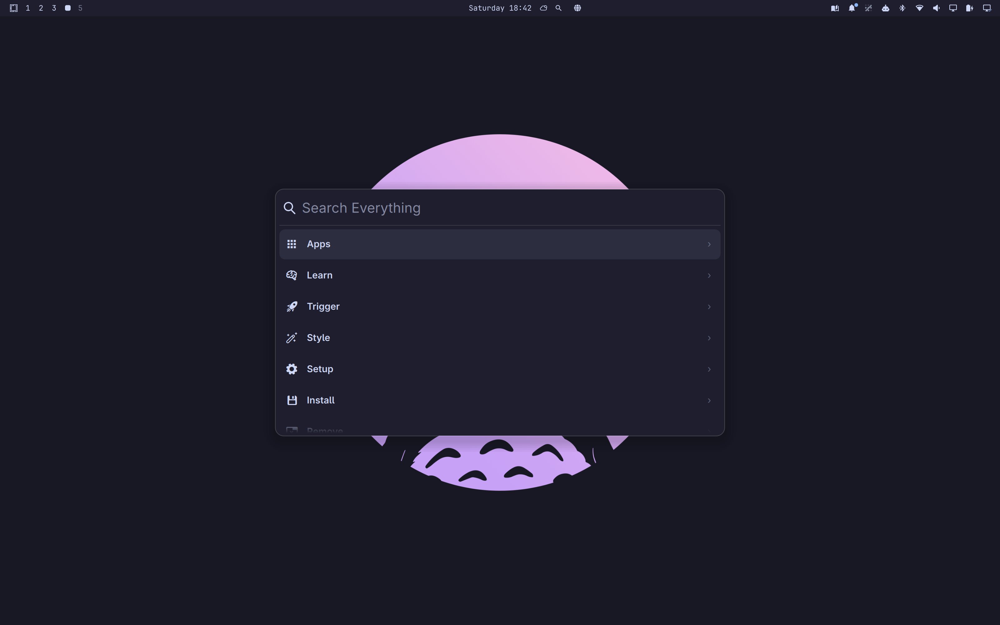

# Spotlight for Omarchy

A Spotlight-style presentation of the existing Omarchy app launcher and
command menu. The app library, search model, commands, keyboard handling, and
launch actions remain part of the original Omarchy menu.



## Features

- Spotlight-style menu presentation
- Search installed applications and Omarchy commands
- Native application icons and menu symbols
- Keyboard navigation with arrow keys and Enter
- Search clearing and menu dismissal with Escape
- Configurable layout, typography, colors, spacing, and icons
- Optional bar widget for opening the menu and settings

## Install

For a checkout of this plugin:

```sh
omarchy plugin validate ~/.config/omarchy/plugins/stash.menu
omarchy-shell shell rescanPlugins
omarchy plugin enable stash.menu
omarchy restart shell
```

The marketplace install command is generated from the public repository when
the plugin is submitted.

The plugin ID is `stash.menu`. It replaces the built-in `omarchy.menu` through
the `clonedFrom` setting in `manifest.json`.

## Usage

- `Super+Space` opens the command menu.
- `Super+Alt+Space` opens applications.
- Type to search.
- Use the arrow keys to select a result.
- Press `Enter` to activate the selected result.
- Press `Escape` to clear the search, then press it again to close the menu.
- Right-click the bar widget to open Spotlight settings.

## Settings

Open the settings window from the Spotlight bar widget or with:

```sh
omarchy-shell spotlight settings
```

Settings can also be managed through the shell IPC interface:

```sh
# Read effective settings
omarchy-shell spotlight get

# Update appearance settings
omarchy-shell spotlight set '{"width":720,"radius":18,"showIcons":true,"iconSize":28}'

# Clear appearance overrides
omarchy-shell spotlight reset

# Launcher actions
omarchy-shell spotlight open
omarchy-shell spotlight apps
omarchy-shell spotlight toggle
omarchy-shell spotlight close
```

IPC overrides are stored on the `stash.menu` entry in `shell.json` and take
priority over the defaults in `Settings.qml`.

## Requirements

- Omarchy with the Quickshell plugin system
- The Omarchy `qs.Commons` and `qs.Ui` modules

Spotlight is not a standalone Quickshell application and does not provide a
separate search index or Apple Spotlight backend.

## Validate

```sh
omarchy plugin validate .
qmllint Menu.qml BarWidget.qml Settings.qml SettingsWindow.qml
```

After installation, verify application search, command search, keyboard
navigation, activation, Escape handling, and the settings window.

## Disable or Remove

To disable the plugin and restore the built-in Omarchy menu:

```sh
omarchy plugin disable stash.menu
omarchy restart shell
```

To remove it completely:

```sh
omarchy plugin remove stash.menu
```

## Attribution

This plugin is derived from the Omarchy `shell/plugins/menu` implementation.
The menu model, application behavior, commands, and launch actions remain
upstream code; Spotlight changes the presentation and adds appearance
settings. Preserve the upstream attribution and license when distributing
this plugin.
